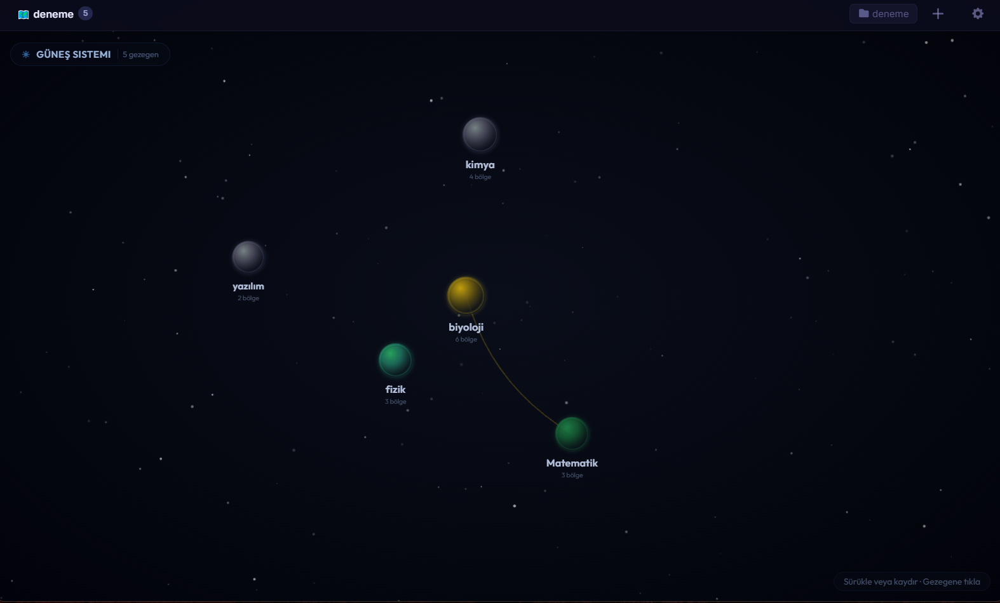
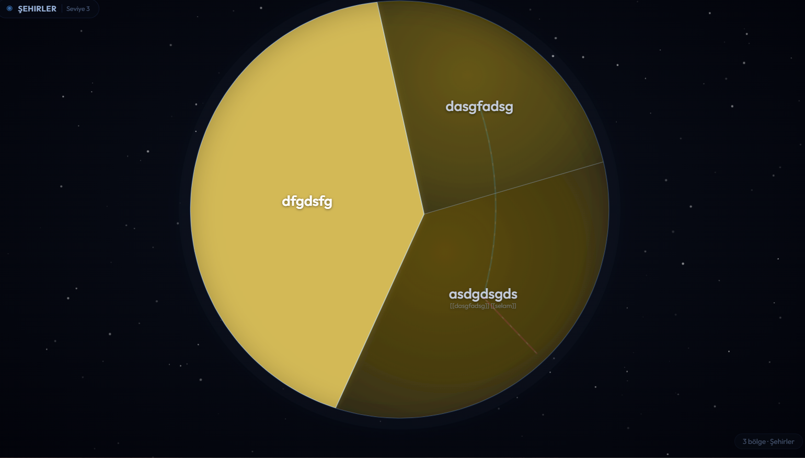

# Mind Map Planet

A clean and practical app to capture ideas fast, turn them into notes, and keep everything organized with folders.  
Built for simplicity: create, group, and review your notes in a distraction-free interface.

---

## Screenshots

> All screenshots are from: `assets/screenshots/`

### Home


### Quick Add Note


### Folders


### User Guide


---

## Why Mind Map Planet?

Keeping ideas scattered across apps or temporary notes makes it easy to lose track. Mind Map Planet keeps your thoughts in one place and helps you structure them with a simple workflow:

1. Create a note in seconds  
2. Place it into a folder (topic/project/category)  
3. Revisit, refine, and keep moving

---

## Features

- **Quick Add Note** for instantly capturing ideas
- **Folder-based organization** to keep content grouped and easy to navigate
- **Simple, readable UI** focused on productivity
- **Built-in User Guide** for onboarding/help

> If you want, you can expand this list with: search, pinning, editing history, export/backup, tags, etc.

---

## Getting Started (Local)

### Prerequisites
- **Node.js** (recommended: latest LTS)
- **npm** (or yarn / pnpm)

Check versions:
```bash
node -v
npm -v
```

### Install & Run
```bash
git clone https://github.com/carus10/Mind-Map-Planet-.git
cd Mind-Map-Planet-
npm install
npm run dev
```

Then open the local URL shown in your terminal (commonly `http://localhost:5173`).

### Build
```bash
npm run build
```

Preview the production build:
```bash
npm run preview
```

---

## Project Layout

```text
Mind-Map-Planet-/
├─ assets/
│  └─ screenshots/
│     ├─ Home.png
│     ├─ Quick Add Note.png
│     ├─ User Guıde.png
│     └─ folders.png
├─ src/
├─ public/
├─ package.json
└─ README.md
```

---

## Roadmap

- [ ] Search & filtering
- [ ] Better folder management (rename, reorder, favorites)
- [ ] Export / backup (JSON, file-based)
- [ ] Themes (dark/light)

---

## Contributing

Contributions are welcome.

1. Fork the repository
2. Create your branch: `git checkout -b feature/my-feature`
3. Commit changes: `git commit -m "Add feature"`
4. Push the branch: `git push origin feature/my-feature`
5. Open a Pull Request

---

## License

Add your license information here (e.g., MIT).  
If you already have a `LICENSE` file, this section can simply reference it.

---

## Author

GitHub: https://github.com/carus10  
Repository: https://github.com/carus10/Mind-Map-Planet-