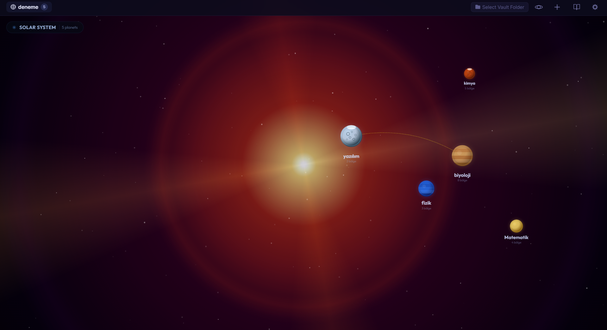
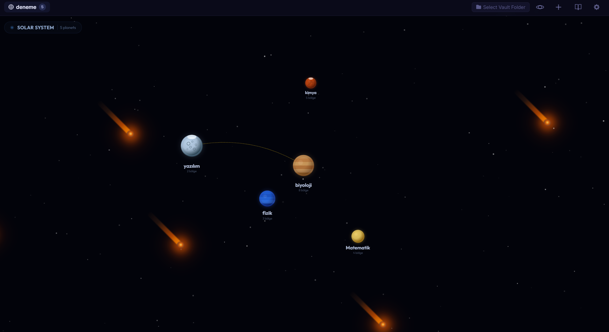
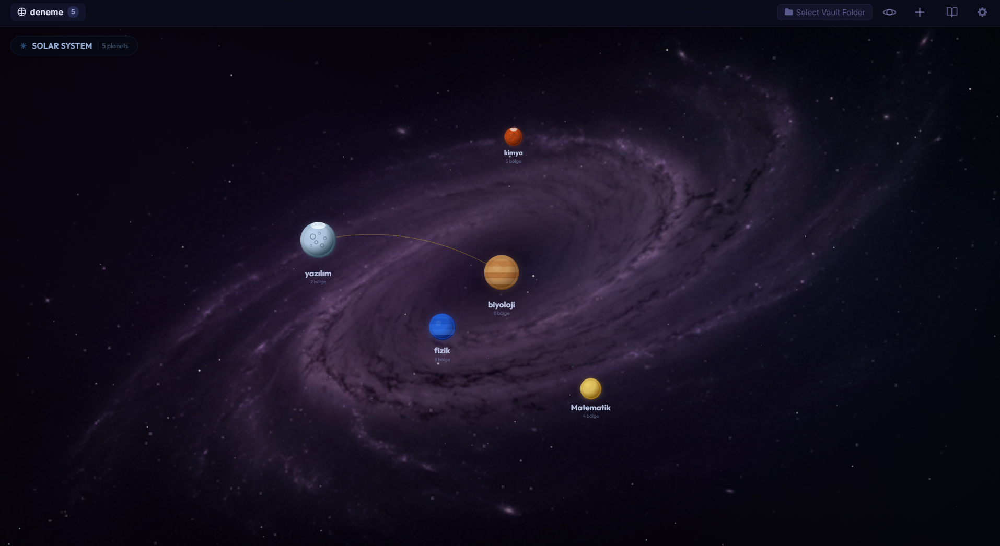
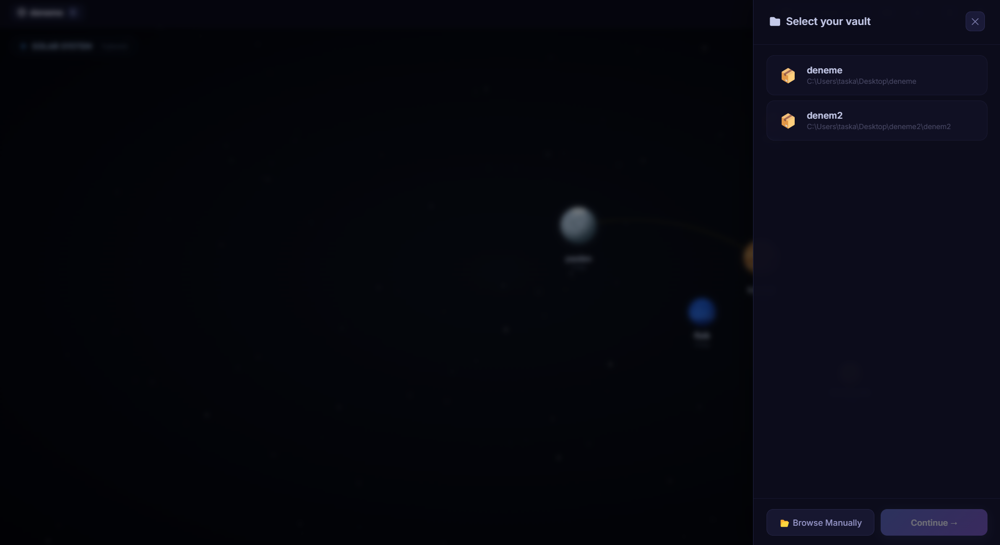
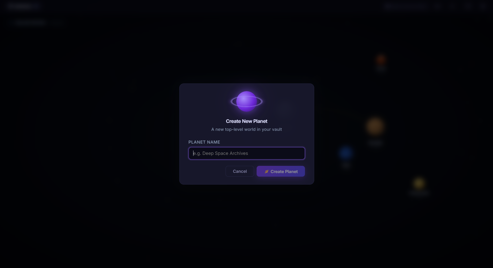
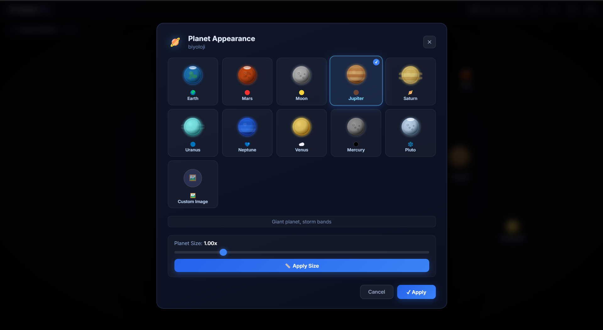
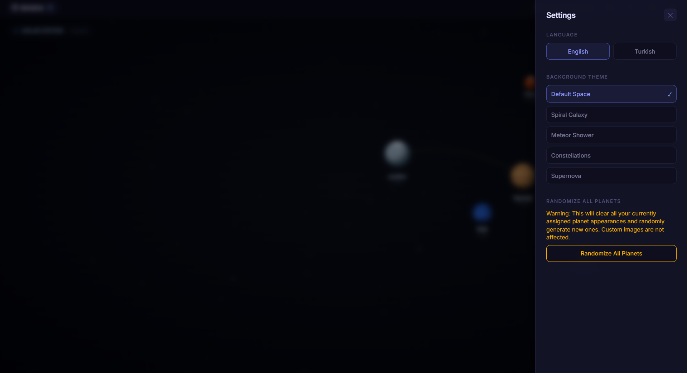

<div align="center">

# 🪐 Mind Map Planet

**Turn your Obsidian vault into an interactive solar system.**

Your folders become planets. Your notes become territories on those planets.  
Navigate your knowledge like exploring space.

[](https://www.electronjs.org/)
[](https://reactjs.org/)
[](https://www.typescriptlang.org/)
[](https://vitejs.dev/)

</div>

---

## 📖 What Is This?

**Mind Map Planet** is an Electron desktop application that reads your [Obsidian](https://obsidian.md/) vault and visualizes its entire folder/note structure as a **solar system**.

In most note-taking apps, your files are buried in an endless tree. Mind Map Planet replaces that with a spatial, planet-based metaphor:

| Vault Structure | Visual Representation |
|---|---|
| **Top-level folders** | Planets orbiting in a solar system |
| **Sub-folders & notes inside a folder** | Territories on the planet's surface (Voronoi cells) |
| **Deeper nesting** | Drill-down into any territory to reveal its own subdivisions |

Click a planet → land on its surface → explore its Voronoi regions → click any note to open it directly in Obsidian.

---

## 🖼️ Screenshots

### Solar System View & Navigation — Your Vault at a Glance

*Each planet represents a top-level folder. Planet size reflects the number of notes inside.*


*Beautiful constellation and space backgrounds to immerse yourself.*


*Select and interact with planets instantly.*


*Seamlessly navigate your note universe.*

### Vault Selection

*Easily switch between different Obsidian vaults with a modern interface.*

### Quick Add Note & Planet Management

*Create new planets (folders) or notes and choose where they belong — all without leaving the app.*

### Custom Planet Appearances

*Customize each planet's look and style to personalize your solar system.*

### Settings & Configuration

*Configure your language, background theme, and vault preferences easily.*

### Built-in User Guide

*An in-app guide walks you through every feature, including detailed keyboard shortcuts.*

---

## ✨ Features

- 🪐 **Solar System Overview** — Top-level folders rendered as glowing, animated planets in space.
- 🌍 **Planet Surface View** — Drill into any planet to see its contents as Voronoi-subdivided territories.
- ⚡ **Instant Vault Scanning** — Point to any Obsidian vault; the app recursively scans all `.md` files and folders.
- 🔗 **One-click Obsidian Integration** — Click any note to open it directly in Obsidian via the `obsidian://` URI.
- ✏️ **Quick Note & Planet Creation** — Create new notes and planets from inside the application.
- 🎨 **Appearance Customization** — Change background themes and individual planet appearances.
- 🗺️ **Interactive Navigation** — Use breadcrumb navigation or drag & drop tools to organize your vault visually.
- 🌐 **i18n Support** — Multi-language UI support.
- 💾 **Persistent Settings** — Vault path and preferences are safely saved using `electron-store`.
- ⌨️ **Keyboard Shortcuts** — Navigate, search, and manage settings efficiently using built-in hotkeys.

---

## 🚀 Getting Started

### Prerequisites

- **Node.js** v18+ (LTS recommended)
- **npm** v9+ (or yarn / pnpm)

You can verify your Node.js and npm versions by running:
```bash
node -v   # Should be v18.0.0 or higher
npm -v    # Should be v9.0.0 or higher
```

### Installation

1. **Clone the repository:**
   ```bash
   git clone https://github.com/carus10/Mind-Map-Planet-.git
   cd Mind-Map-Planet-
   ```

2. **Install dependencies:**
   ```bash
   npm install
   ```

### Development

To start the application in development mode with hot-module replacement (HMR), run:
```bash
npm run dev
```
Code changes will be reflected immediately in the running app.

### Production Build

To build the application for production, you can use the following commands:

```bash
# Build the application only
npm run build

# Build the application AND generate a Windows installer (.exe)
npm run dist:win

# Build the application AND generate platform-specific installers based on your OS if configured
npm run dist
```

The compiled binaries and installers will be generated in the `release/` directory based on the `electron-builder` configuration in `package.json`.

### Testing

```bash
# Run all tests
npm test

# Run tests in watch mode
npm run test:watch
```

---

## 🏗️ Tech Stack

| Layer | Technology | Purpose |
|-------|-----------|---------|
| **Runtime** | Electron 31 | Cross-platform desktop shell |
| **Bundler** | electron-vite 2 | Electron + Vite integration |
| **UI** | React 18 | Component-based user interface |
| **Language** | TypeScript 5.5 | Type-safe development |
| **State** | Zustand 4 | Lightweight global state management |
| **Geo Rendering** | D3-geo, D3-delaunay, D3-polygon | Geographic projections, Voronoi tessellation |
| **Storage** | electron-store | Persistent app settings |

---

## 🤝 Contributing

Contributions are welcome! Here's how you can help:

1. **Fork** this repository.
2. Create a feature branch: `git checkout -b feature/amazing-feature`.
3. Commit your changes: `git commit -m "feat: add amazing feature"`.
4. Push to the branch: `git push origin feature/amazing-feature`.
5. Open a **Pull Request**.

---

## 📄 License

This project is licensed under the MIT License. See the [LICENSE](LICENSE) file for details.

---

<div align="center">

**Mind Map Planet** — Explore your knowledge like a universe. 🪐

Built by [@carus10](https://github.com/carus10)

⭐ Star this repo if you find it useful!

</div>